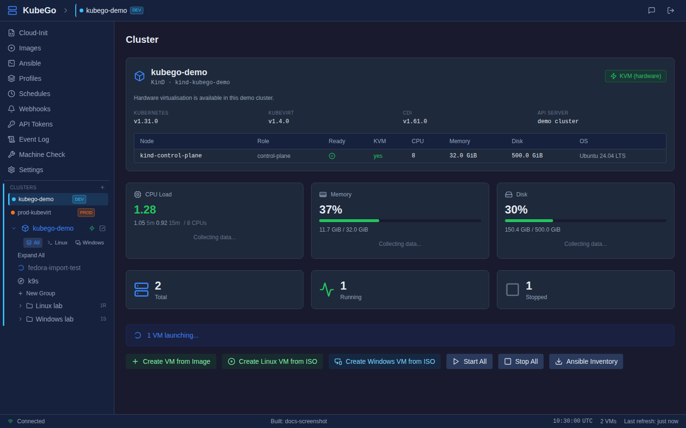
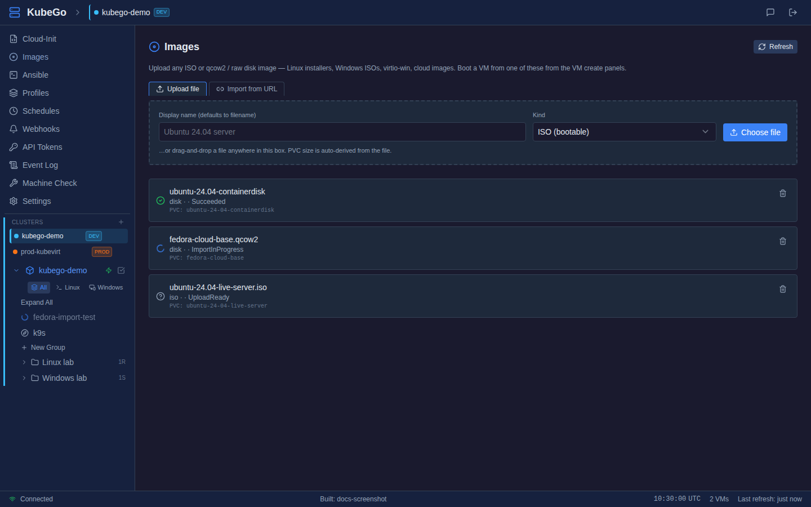
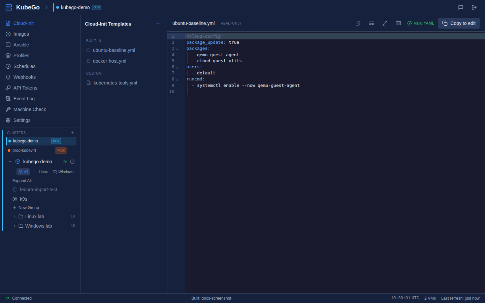
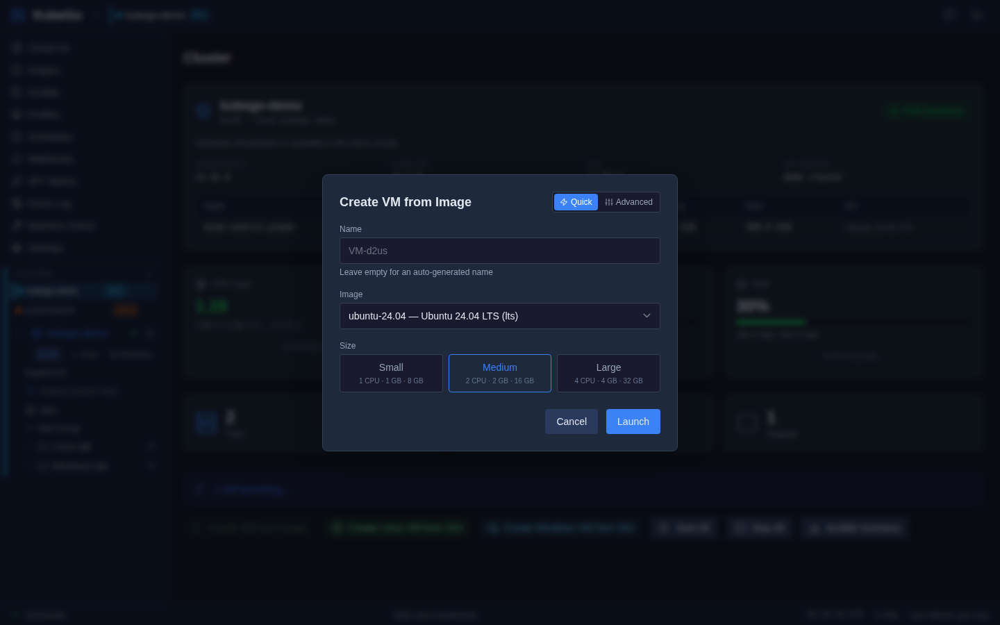
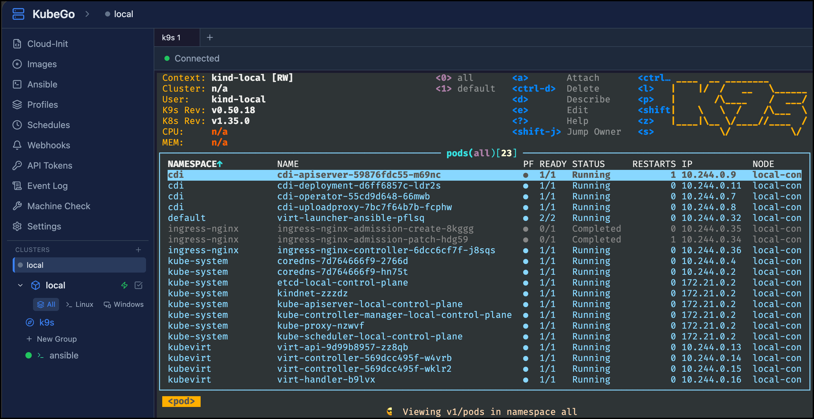

# KubeGo

A browser UI and REST API for [KubeVirt](https://kubevirt.io/) — drives VMs as Kubernetes resources so a single commodity cluster can carry VMs alongside containers. Forked from [PassGo Web](https://github.com/rootisgod/passgo-webui) and progressively retargeted away from Canonical Multipass.

> **Status: pre-alpha.** The binary builds, boots against a cluster, and can create / list / start / stop / delete an Ubuntu 24.04 VM end-to-end via `quay.io/containerdisks/ubuntu:24.04` (a containerDisk — ephemeral, no PVC yet). The KubeGo-shaped Vue UI is wired to the backend with a serial console, logs tab, cluster info page, and a multi-cluster switcher that can create and delete KinD clusters in-browser with KubeVirt+CDI auto-installed. Snapshots, PVC hot-plug disks, resize, guest-agent exec, file transfer, and Ansible still return `ErrNotImplemented`. See [PLAN.md](PLAN.md) for the milestone breakdown.

## Screenshots

The screenshots below use demo data so they can be published without exposing a real cluster, token, kubeconfig, VM address, or local path.



*Cluster dashboard showing active context, KubeVirt/CDI status, node details, resource cards, VM counts, and the VM creation actions.*



*Images page for browser uploads and URL imports backed by CDI DataVolumes, including ISO and disk image status.*



*Cloud-init template library with built-in and custom templates plus YAML validation and copy-to-edit workflow.*



*Quick create modal for launching a VM from an image with name, image, and size preset fields.*



*Embedded k9s running inside the KubeGo web UI, with a server-side PTY proxied into an xterm.js panel for the active cluster.*

## Bare-minimum quickstart on a new machine

This is the shortest path from a clean laptop to "binary running against a local KinD cluster with KubeVirt installed". Four steps; the third one takes 5–10 minutes on first run and the rest are seconds.

### 1. Install the six dependencies

You need `go`, `docker` (Docker Desktop or engine, so KinD has a container runtime to run on), `kind`, `kubectl`, `curl`, and `git`. Nothing else.

**macOS (Homebrew):**

```bash
brew install go kind kubectl
# Docker Desktop: https://www.docker.com/products/docker-desktop/
# (curl and git ship with macOS already.)
```

**Ubuntu/Debian:**

```bash
sudo apt update && sudo apt install -y golang-go kubectl curl git docker.io
# Install kind (no apt package yet):
curl -Lo /tmp/kind https://kind.sigs.k8s.io/dl/latest/kind-linux-amd64
chmod +x /tmp/kind && sudo mv /tmp/kind /usr/local/bin/kind
# Let your user run docker without sudo (takes effect on next login):
sudo usermod -aG docker "$USER"
```

Verify: `go version`, `docker info`, `kind version`, `kubectl version --client`. The repo's Go build requires **Go 1.26.1** — if `apt` gives you an older version, install from [go.dev/dl](https://go.dev/dl/) instead.

### 2. Clone the repo

```bash
git clone https://github.com/rootisgod/kubego-webui.git
cd kubego-webui
```

### 3. Create a KinD cluster with KubeVirt installed

```bash
task kind:up
```

Creates a `kubego-dev` cluster, installs the KubeVirt operator + CR, installs CDI, and waits for both to become `Available`. If the host has `/dev/kvm`, bind-mounts it into the KinD node for hardware acceleration; otherwise patches KubeVirt into software-emulation mode. Idempotent — re-run it any time. First run takes 5–10 minutes; subsequent runs are seconds.

After the binary is up (step 4), additional KinD clusters can be spun up from the sidebar cluster switcher in the UI — that path streams the same install chain over SSE and auto-activates the new context. Running more than one kind cluster on the same host also needs `fs.inotify.max_user_instances` raised above the Ubuntu default of 128, or the second cluster's `coredns` and `virt-operator` will silently fail to watch the API; the UI's **Machine Check** sidebar entry diagnoses and (as root) applies the fix.

### 4. Build the binary and run it

```bash
task run
```

This builds `./kubego` and runs it against `~/.kube/config` on port 8081. Leave it running; open `http://localhost:8081` (login `admin` / `admin`). The UI lists VMs from the active context, lets you create/start/stop/delete them, serves the serial console, and exposes the cluster switcher. Verify in the logs:

```
level=INFO msg="kubevirt driver ready" source=kubeconfig:... namespace=default server=...
level=INFO msg="kubevirt detected" group=kubevirt.io version=v1 ...
```

Or hit the API directly:

```bash
curl -s localhost:8081/api/v1/version
```

### Tear down

```bash
# Stop the binary: Ctrl-C in its terminal.
task kind:down
```

## What is it aimed at?

Any Kubernetes cluster that can run KubeVirt — homelab, on-prem, managed (EKS/AKS/GKE with nested-virt nodes), or a dev KinD cluster. There is no KinD-specific code in the binary; KinD is only the dev/test convenience, and the `scripts/` directory codifies that setup. The deployment target is in-cluster as a pod (Helm chart lands in M0 Slice 3); running standalone against `~/.kube/config` is the supported dev mode.

## Variants of the quickstart

### Validate the build without any cluster

If you just want to confirm the binary is wired correctly before touching KinD, the smoke test works against any kubeconfig — including an unreachable one. The KubeVirt probe logs a warning; the HTTP server comes up anyway.

```bash
./scripts/smoke-test.sh
# or: task smoke
```

Expected output ends with `Smoke test passed.` and the captured startup log contains one of:

```
level=WARN  msg="kubevirt probe failed" err="...dial tcp ...: connect: connection refused"
level=WARN  msg="kubevirt not installed on target cluster — VM operations will return 501 until KubeVirt is installed"
level=INFO  msg="kubevirt detected" group=kubevirt.io version=v1 ...
```

### Point at an existing cluster instead of KinD

Skip step 3. Step 4 works unchanged — the binary only cares that `--kubeconfig` resolves to a reachable API server. Production-grade clusters with real nodes don't need the `useEmulation` patch.

### Override KinD defaults

```bash
KUBEGO_KIND_CLUSTER=my-cluster \
KUBEVIRT_VERSION=v1.2.0 \
CDI_VERSION=v1.59.0 \
task kind:up
```

`KUBEVIRT_VERSION` / `CDI_VERSION` are also honoured by the UI-create flow when set on the server process environment.

### Using Task

[`task`](https://taskfile.dev/) is optional — every Taskfile entry maps 1:1 to a shell command. `task kind:up`, `task run`, `task smoke`, `task kind:down` cover the quickstart path.

> On hosts without `/dev/kvm`, KubeVirt runs in **software emulation** (10–100× slower than KVM). Fine for wiring and integration tests; don't run real workloads. Both `task kind:up` and the UI-create flow detect `/dev/kvm` on the host and bind-mount it into the KinD node when available; otherwise they patch `useEmulation: true`.

## What works today

- `go build ./...` and `go vet ./...` clean on Go 1.26.1.
- Kubernetes config discovery: in-cluster first, then `--kubeconfig` / `$KUBECONFIG` / `~/.kube/config`.
- Startup discovery probe for `kubevirt.io/v1`; logs, not crashes, when absent.
- Session + bearer-token auth, rate limiting, event log, config load/save, REST endpoints for every resource the driver exposes.
- Filesystem-backed helpers for cloud-init templates and Ansible playbooks survive the rewrite. Both carry a set of built-in examples embedded into the binary via `//go:embed` (`cmd/server/cloud-init/*.yml` and `cmd/server/playbooks/*.yml`): list/get endpoints surface them alongside user files with a `builtIn` flag, and the UI renders them in a separate "Built-in Examples" group with a read-only editor. For built-in playbooks the runner extracts the embedded content to a temp file at run-time so `ansible-playbook` can exec it, then cleans the temp up when the run exits.
- **First-VM backend slice:** `POST /api/v1/vms` creates a `VirtualMachine` CR plus a cloud-init `Secret` (owner-ref'd to the VM so it GCs on delete). `GET /api/v1/vms[/{name}]` reads state from `status.printableStatus`, falling back to `spec.runStrategy` pre-observation. `start` / `stop` patch `runStrategy`; `DELETE` removes the CR.
- **Persistent root disks:** the VM's root disk is declared via `spec.dataVolumeTemplates`, so KubeVirt creates a CDI-backed DataVolume that imports the `quay.io/containerdisks/...` image (via `source.registry` with the default `pullMethod: pod`) into a PVC sized to the user's chosen `diskGB`. The DV and its PVC are owned by the VM → they GC together on delete. The template sets `accessModes: [ReadWriteOnce]` and `volumeMode: Filesystem` explicitly — if omitted, CDI falls back to the cluster's `StorageProfile`, and for unrecognised provisioners (like `rancher.io/local-path` on KinD) that profile has no `claimPropertySets` and the DV dies with `ErrClaimNotValid`. `storageClassName` is still left unset so the cluster default wins. Disk state now survives stop/start; Ubuntu cloud-init's `growpart` expands the root filesystem into whatever size was requested on first boot.
- **Launch VM flow:** the Cluster panel exposes three create paths so each install style has its own surface. **Create VM from Image** opens the Quick modal — name, image, and a three-button size preset (Small `1 CPU · 1 GB · 8 GB`, Medium `2 CPU · 2 GB · 16 GB`, Large `4 CPU · 4 GB · 32 GB`) — so the happy path stays close to `multipass launch`-style brevity; Advanced mode reveals the full form (profile, manual resources, cloud-init template, network, post-launch playbook) plus optional guest-identity fields (hostname, extra sudo user + password, additional SSH public key) and hardware knobs (UEFI firmware via OVMF without SecureBoot, extra blank data disks) that cloud-init applies on first boot. "Save as Profile" persists the whole shape. "Medium" matches the out-of-the-box config defaults (`VMDefaults{CPUs: 2, MemoryMB: 2048, DiskGB: 16}` in `internal/config/config.go` and `DefaultRAMMB`/`DefaultDiskGB` in `pkg/kubevirt/constants.go`), so a bare launch gives you a VM with comfortable headroom for a modern distro. **Create Linux VM from ISO** (`POST /api/v1/vms/linux-iso`) boots an uploaded Linux installer ISO against a blank DataVolume — the user drives the installer interactively via the Graphics tab (noVNC); BIOS/SeaBIOS by default with an opt-in UEFI toggle. **Create Windows VM from ISO** (`POST /api/v1/vms/windows`) runs an unattended install from an uploaded Windows ISO + virtio-win ISO with autounattend.xml, Secure Boot + vTPM defaults for Windows 11, and RDP enabled on first boot. Both ISO modals link straight to the Images page so uploading a new installer is a single click away.
- **Multi-cluster switcher:** `GET /api/v1/clusters` enumerates kubeconfig contexts (decorated with user-chosen tag + accent colour from `cluster_metadata` in config); `POST /api/v1/clusters/select` flips the active one; `PUT /api/v1/clusters/{context}/metadata` persists a tag/colour pair for a context. `POST /api/v1/clusters/kind` and `DELETE /api/v1/clusters/kind/{name}` shell out to `kind` with SSE progress; create bundles the KubeVirt + CDI install (operator, CR, optional `useEmulation` patch, wait-for-Available) and bind-mounts host `/dev/kvm` into the KinD node when present. The KinD create modal can optionally preload the KubeVirt/CDI install images into the node; Settings stores the default under `kind.preload_images`, but this is only a creation-time cache optimization. Auto-selects the new context on create; falls back to a surviving context on delete. The sidebar renders a vertical stack of cluster "chips" (each with its colour dot + tag badge), and the active cluster's colour is applied as a left-edge stripe down the whole cluster-scoped region — so `kind-dev`, `kind-staging`, and `kind-prod` stay visually distinct and destructive actions on the wrong environment are easier to catch. The app header carries the same chip as a persistent breadcrumb: brand › [● dev], so you always see which environment you're operating on even when the sidebar is scrolled. In-cluster mode hides KinD ops.
- **KinD Image Cache:** the cluster-scoped Image Cache panel lists local Docker images on the server host and checks whether each exact image reference is already present in the active KinD cluster's node runtime. Users can load one image or select multiple missing images and batch-load them with a progress dialog; the backend streams `kind load docker-image --name <cluster> <image>` output and refreshes status afterwards. This is separate from the KubeVirt/CDI install preload and is useful when the host has already pulled or built large images that workloads should consume without a registry round-trip.
- **Serial console:** Multi-session VNC-less virt-api SerialConsole proxy, rendered with xterm.js; scrollback survives tab switches within a VM.
- **Machine Check:** `GET /api/v1/host/check` surfaces the external CLIs the server shells out to (`kind`, `kubectl`, `docker`, `k9s`, `task`) and the kernel sysctls that bite multi-cluster kind setups (`fs.inotify.max_user_instances`, `fs.inotify.max_user_watches`). `POST /api/v1/host/sysctl` applies the recommended values to `/proc/sys` when the server is running as root on linux outside a cluster; the UI exposes this via a sidebar entry and shows the `/etc/sysctl.d` snippet for persistence.
- **Ansible SSH plumbing:** on first start the server generates an ed25519 keypair at `<configDir>/id_kubego_ed25519(.pub)` and records the paths in `config.VMDefaults.SSHPublicKey`/`SSHPrivateKey`. Every `POST /api/v1/vms` merges the public key into the cloud-init document under the top-level `ssh_authorized_keys`, so cloud-init applies it to the `ubuntu` default user at first boot — no user-side key config needed. Running an Ansible playbook no longer relies on the host being routable into the cluster's pod CIDR: before each run the server spawns one `kubectl port-forward pod/virt-launcher-<vm> <randomLocal>:22` per target VM (KubeVirt's masquerade interface maps pod:22 → VM:22), rewrites the inventory to point at `127.0.0.1:<port>` with `ansible_ssh_common_args: -o StrictHostKeyChecking=no -o UserKnownHostsFile=/dev/null`, and tears the forwards down alongside the temp inventory when the run exits. VMs created before this shipped won't have the key baked in — recreate them to pick it up.
- **Embedded k9s:** a **k9s** entry nested under the active cluster in the sidebar tree (alongside the VM list) spawns `k9s --context <active>` in a server-side PTY and proxies it over a WebSocket into xterm.js. Sidebar is split into a global nav (cloud-init, ansible, profiles, schedules, webhooks, tokens, events, machine check, settings) and a cluster-scoped region (cluster switcher + tree containing k9s and VMs), so it's visually obvious that switching clusters resets the k9s tabs. Clicking the sidebar entry auto-spawns a session (no "Start k9s" button to press first), and the panel stays mounted as you navigate to VMs and back — tabs, scrollback, and the underlying PTYs survive. Multi-tab per active context; switching KubeGo's active cluster closes open sessions so they don't drift onto the wrong cluster and auto-spawns a fresh one if you're still looking at the panel. `POST /api/v1/host/tools/k9s/install` streams `scripts/k9s-install.sh` via SSE when the binary is missing. k9s is Apache-2.0; we shell out to a user-installed binary rather than bundling, so no redistribution obligations. Disabled automatically in in-cluster mode (cluster-admin blast radius).

## What does not work yet

| Area | Status | Milestone |
|------|--------|-----------|
| Snapshots / clone | Stubbed — UI tab renders, list call 500s | M4 |
| PVC hot-plug disks | Stubbed — AttachDisk/DetachDisk return 501 | M4 |
| Resize / guest-agent exec | Stubbed | M5 |
| Multi-namespace tenancy | Single-namespace only | M6 |
| Ansible inventory, file transfer | Stubbed — TransferFromVM/TransferToVM return 501 | M7 |
| Metrics / Kubernetes Events | Stubbed (load-avg cards show a pod-request proxy) | M8 |
| CAPK (workload clusters) | Not in scope | M9 |
| Helm chart | Missing | M0 Slice 3 |

## Development

### Useful Taskfile targets

```
task build-backend       Build kubego without rebuilding the frontend
task run                 Build + run against ~/.kube/config
task dev-backend         go run ./cmd/server (no binary produced)
task smoke               End-to-end smoke test
task kind:install        Install the kind CLI
task kind:up             Create kubego-dev KinD cluster + KubeVirt + CDI
task kind:down           Delete kubego-dev KinD cluster
task kind:reset          Delete and recreate
task install-kubectl     Install the kubectl CLI
task install-k9s         Install the k9s CLI
task service-deploy      Build, install /usr/local/bin/kubego, and restart systemd
task test                go test ./... -v
task clean               Remove all build artifacts
```

All Taskfile entries are shell commands; `cat Taskfile.yml` if you want the plain invocation. The `install-*` and `kind:install` tasks each call a script in `scripts/` directly — you can run those without Task installed.

### Running as a systemd service (Linux)

To run KubeGo as a managed background service on a Linux host, build a binary and let `service-install` do the rest — it copies the binary into `/usr/local/bin/kubego`, writes `/etc/systemd/system/kubego.service`, then enables and starts it (listening on `:8081` by default):

```bash
task build               # native binary, or: task build-all (produces dist/kubego-linux-amd64)
sudo task service-install
```

The service runs as root and resolves its cluster from in-cluster config, then `$KUBECONFIG`, then `/root/.kube/config`. If none of those are present, `service-install` warns and you can point `ExecStart` at an explicit kubeconfig in the unit file.

```
task install-binary      Copy the built binary to /usr/local/bin/kubego (sudo)
task service-install     Install + enable + start the systemd service (sudo)
task service-deploy      Build + install the fresh ./kubego binary + restart (sudo)
task service-start       Start the service (sudo)
task service-stop        Stop the service (sudo)
task service-restart     Restart the service (sudo)
task service-status      systemctl status kubego
task service-logs        Follow logs (journalctl -u kubego -f)
task service-remove      Stop, disable, and remove the service + binary (sudo)
task update-binary-linux Download the latest GitHub release, swap the binary, restart (sudo)
```

`update-binary-linux` is the no-build update path for an already-deployed host: it pulls the latest `kubego-linux-amd64` release asset, replaces the installed binary, and restarts the service.

### Layout

```
cmd/server/              Go entrypoint, embeds frontend/dist and cloud-init templates
internal/api/            HTTP handlers and middleware
internal/config/         App config load/save, password hashing
pkg/kubevirt/            Driver interface (all VM operations live behind here)
  client.go              NewClient, rest.Config wiring
  vms.go                 VM lifecycle via dynamic client (Launch/List/Get/Start/Stop/Delete)
  unimplemented.go       Stub for methods not yet ported; VM methods now live in vms.go
  types.go               Wire types (VMInfo, DiskInfo, ClusterResources, ...)
  constants.go           Validation helpers, defaults
  cloudinit_files.go     Template read/write/scan (filesystem, not KubeVirt-coupled)
  playbooks_files.go     Ansible playbook read/write (same)
frontend/                Vue 3 app (still PassGo-shaped; ports in M0 Slice 3)
scripts/
  kind-up.sh             Create + configure kubego-dev KinD cluster
  kind-down.sh           Delete kubego-dev KinD cluster
  smoke-test.sh          End-to-end binary smoke test
PLAN.md                  The rewrite roadmap and design decisions
```

### Driver interface

`pkg/kubevirt.Client` is the single seam between HTTP handlers and the KubeVirt API. Every milestone M1–M9 fills in method bodies without changing handler code. The interface preserves PassGo's signatures where sensible (single-namespace string identifiers in M0) and introduces `VMRef{Namespace, Name}` in M6 when multi-namespace mode lands.

To implement a method: replace the `ErrNotImplemented` return in `pkg/kubevirt/unimplemented.go` (or split the method into a dedicated file, e.g. `vms.go`, and have the struct delegate there). All handler code continues to work.

## API

All endpoints are under `/api/v1/`. Auth via session cookie or `Authorization: Bearer <token>`. The [PLAN.md §3](PLAN.md) table lists every endpoint with its KubeGo verdict. Notable PassGo → KubeGo changes:

- `/host/resources` → `/cluster/resources`.
- `/vms/{name}/mounts*` → `/vms/{name}/disks*` (PVC hot-plug, not host bind-mounts).
- `/vms/{name}/recover`, `/vms/purge`, `/host/files`, `/host/home`, `/mounts/open` — **removed**.
- `/vms/{name}/suspend` — kept as alias for stop.
- `/vms/{name}/shell/sessions*` + the `/vms/{name}/shell/{sessionId}` WebSocket — back, proxying virt-api's `SerialConsole` subresource.
- `/clusters*` — new; kubeconfig context list + select, KinD create/delete with SSE progress streams. Create bundles KubeVirt + CDI install.
- `/clusters/kind/images*` — new; list host Docker images, report whether each image is loaded into the active KinD cluster, and stream `kind load docker-image` for one or more selected images via the Image Cache panel.
- `/host/check`, `/host/sysctl`, `/host/tools/k9s/install` — new; Machine Check panel surfaces CLI + sysctl prereqs and runs the k9s installer.
- `/k9s/sessions*` + the `/k9s/sessions/{sessionId}/ws` WebSocket — new; PTY-backed k9s sessions.
- `/images/uploads*` + `/images/imports` — new; CDI-backed image catalogue (upload via browser stream, or import from a URL via CDI `source.http`). PVC size for file uploads is auto-derived from the file size + 1 GB cushion — no size input in the UI.
- `/vms/windows`, `/vms/linux-iso` — new; ISO-based create paths. Windows runs an unattended install (autounattend.xml + virtio-win); Linux boots the ISO for an interactive install via the Graphics tab.

## Roadmap

| Milestone | Scope | Status |
|-----------|-------|--------|
| M0 | Driver interface + cluster wiring + CRD probe. | shipped |
| M1–M3 slice A | VM create/list/start/stop/delete against containerDisk. | shipped |
| M1–M3 slice B | Frontend port: VM list + create dialog + lifecycle against the new backend. | shipped |
| M2 console | Serial console via virt-api `SerialConsole` subresource. | shipped |
| Multi-cluster | Kubeconfig switcher + UI-driven KinD create/delete with KubeVirt+CDI auto-install and `/dev/kvm` passthrough. | shipped |
| KinD Image Cache | Cluster-scoped panel for loading host Docker images into the active KinD cluster with batch progress. | shipped |
| Machine Check | Sidebar panel: external tool discovery (`kind`, `kubectl`, `docker`, `k9s`, `task`) + kernel sysctl prereqs with one-click apply. | shipped |
| Embedded k9s | PTY-backed k9s terminal proxied into xterm.js; scoped to the active kubeconfig context. | shipped |
| M1–M3 slice D | Swap containerDisk for DataVolume + PVC so disks persist. | shipped |
| M4 | Snapshots, clone (snapshot+restore), PVC hot-plug disks. | pending |
| M5 | Resize, guest-agent exec, bulk. | pending |
| M6 | Multi-namespace tenancy (optional). | pending |
| M7 | Ansible inventory from VMIs, file transfer via guest agent. | pending |
| M8 | Cluster node metrics, optional Kubernetes Events mirror. | pending |
| M9 | CAPK workload clusters. | pending |
| M0 Slice 3 | Helm chart for in-cluster deployment. | pending |

## Tech stack

- **Backend:** Go 1.26, `k8s.io/client-go`, single binary with embedded frontend via `go:embed`.
- **Driver:** `pkg/kubevirt` — interface-first, stubbed today; typed KubeVirt client lands in M1.
- **Frontend (pending port):** Vue 3 + Vite + Tailwind + Pinia, xterm.js, CodeMirror 6.

## License

MIT (inherited from PassGo Web).
